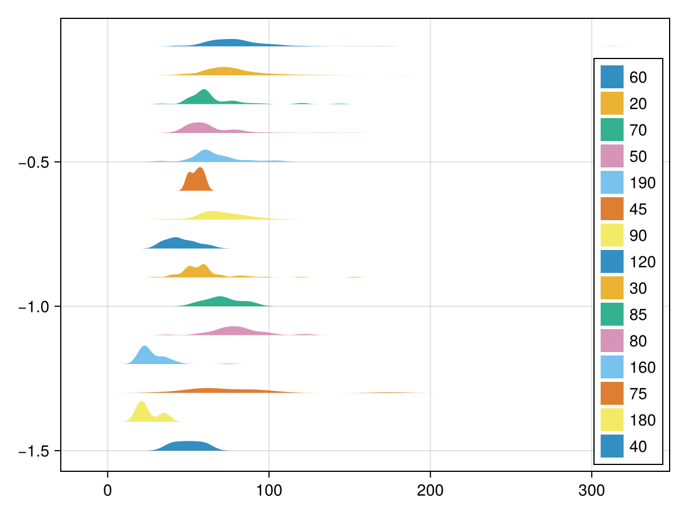
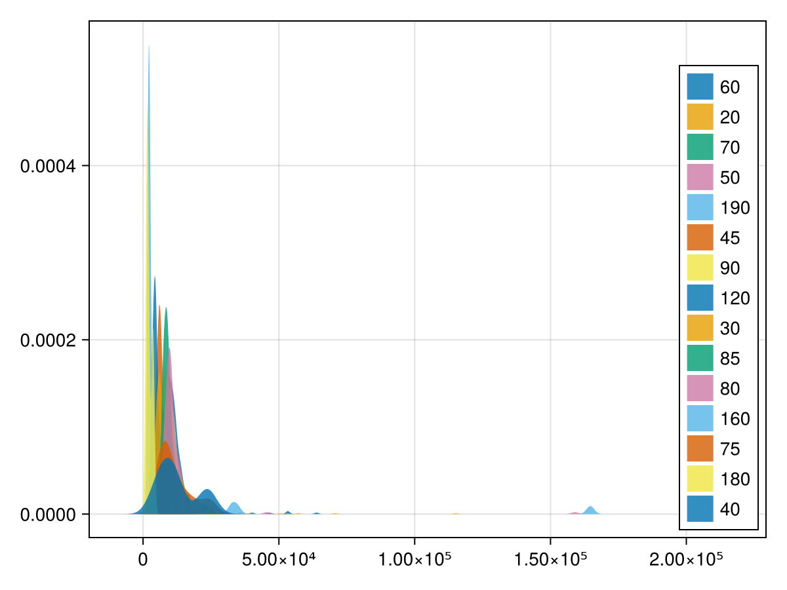

# Dataset Explorations

````julia
using Revise
using HousePricesPredict
using CSV
using DataFrames
using ColorSchemes
using CairoMakie

import HousePricesPredict: parse_or_nan, skipnan
````

## Import Train Data

````julia
train = DataFrame(CSV.File("C:\\Users\\Dong\\Project\\HousePricesPredict.jl\\assets\\train.csv"));
````

## Analysis

### MSSubClass - Plot each of numerical features distribution for each Class

#### LotFrontage

````julia
train.LotFrontage = parse_or_nan.(String.(train.LotFrontage))
train.MSSubClass = string.(train.MSSubClass)

cats = unique(train.MSSubClass)

f = Figure()
Axis(f[1, 1])
for (i, cat) in enumerate(cats)
    density!(skipnan(train[train.MSSubClass .== cat, "LotFrontage"]);
        label=string(cat),
        offset=-i * 0.1,
    )
end
axislegend(position=:rb, colormap=:)
f
````


From the plot, we can see that based on lot frontage, we have 5 categories
- Cat 1: 20, 60, 80, 85, 90
- Cat 2: 50, 70, 190,
- Cat 3: 160, 180
- Cat 4: 30, 40, 45, 120
- Cat 5: 75

#### LotArea

````julia
f = Figure()
Axis(f[1, 1])
for (i, cat) in enumerate(cats)
    density!(skipnan(train[train.MSSubClass .== cat, "LotArea"]);
        label=string(cat),
        #offset=-i * 100,
    )
end
axislegend(position=:rb, colormap=:)
f
````


